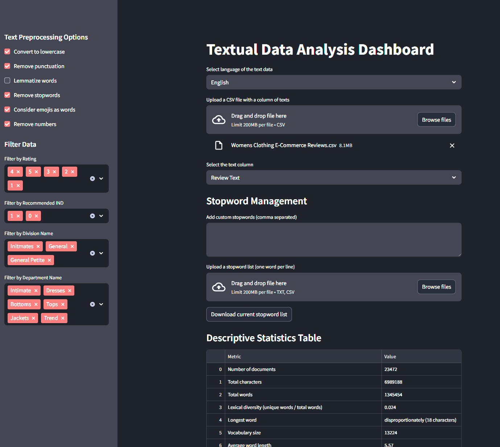

# Bruno Guide's Textual Data Analysis Dashboard

A powerful, interactive Streamlit dashboard for exploring and analyzing text datasets in English or Portuguese.  
Supports advanced NLP features, emoji handling, and customizable preprocessing.

---

## Features

- **Language Support:** English and Portuguese (spaCy models)
- **Flexible Preprocessing:** Lowercasing, punctuation removal, lemmatization, stopword removal, emoji handling
- **Custom Stopwords:** Add, upload, or download stopword lists
- **Interactive Filtering:** Filter data by any column with few unique values
- **Descriptive Statistics:** Document count, character/word counts, lexical diversity, longest word, vocabulary size
- **N-gram Analysis:** Customizable n-gram size and top-n display, interactive bar chart, CSV export
- **Keyword-in-Context (KWIC):** Search for any word or emoji, view context, export results as CSV
- **Word Cloud:** Visualize most frequent words (excluding stopwords)
- **Word Frequency:** Top 10/20 most common words, interactive bar chart
- **Hapax Legomena:** Count of words that occur only once
- **Sentence Statistics:** Number of sentences, average sentence length
- **POS Tagging:** Part-of-speech frequency table and CSV export
- **Named Entity Recognition (NER):** Entity type counts, top entities, interactive chart, CSV export
- **Topic Modeling (LDA):** Discover topics, interactive visualization, CSV export

---

## Usage

1.1 **Install requirements:**
    ```
    pip install -r requirements.txt
    ```
1.2 **Install spacy models:**
    ```
    python setup_spacy.py
    ```

2. **Run the dashboard:**
    ```
    streamlit run NLP_dash.py
    ```

3. **Upload your CSV file** and select the text column.

4. **Adjust preprocessing options** (lowercase, punctuation, lemmatization, stopwords, emoji handling).

5. **Explore your data** using the sidebar filters and main dashboard features.

---

## Requirements

- Python 3.8+
- See `requirements.txt` for all dependencies:
    - streamlit
    - pandas
    - spacy
    - emoji
    - altair
    - matplotlib
    - wordcloud
    - scikit-learn

You will also need the spaCy models:
```
python -m spacy download en_core_web_sm
python -m spacy download pt_core_news_sm
```

---

## Notes

- **Emoji Handling:** Toggle "Consider emojis as words" to include/exclude emojis from all analyses.
- **Custom Stopwords:** Add via text area, upload a file, or download the current list.
- **Export:** Download results for n-grams, POS, KWIC, NER, topics, and wordcloud images.

---

## Example



---

## License

MIT License

---

**Created by Gruno using Streamlit and Copilot**